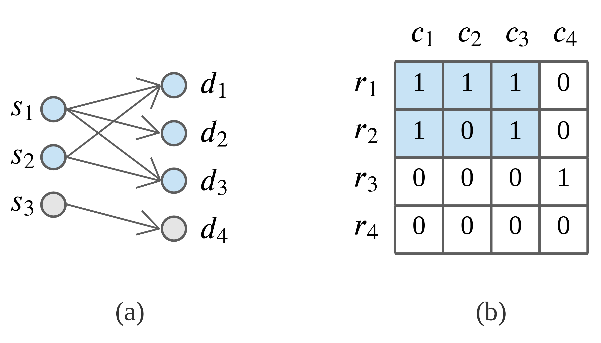

# AnoGraph

<p>
  <a href="https://arxiv.org/pdf/2106.04486.pdf"></a>
  <a href="https://github.com/Stream-AD/AnoGraph/blob/master/LICENSE">
    
  </a>
</p>

Implementation of

- [Sketch-Based Anomaly Detection in Streaming Graphs](https://arxiv.org/pdf/2106.04486.pdf). Siddharth Bhatia, Mohit Wadhwa, Kenji Kawaguchi, Neil Shah, Philip S. Yu, Bryan Hooi

Existing methods only detect edge or subgraph anomalies. We extend count-min sketch to higher-order preserving the dense subgraph structure & detect both. Our approach is the first streaming method that uses dense subgraph search to detect graph anomalies in constant memory and time.



(a) Dense subgraph in the original graph between source nodes s1, s2, and destination nodes d1, d2, d3 is transformed to a (b) Dense submatrix between rows r1, r2, and columns c1, c2, c3 in the higher order CMS.

AnoEdge-G and AnoEdge-L detect edge anomalies by checking whether the received edge when mapped to a sketch matrix element is part of a dense submatrix. AnoEdge-G finds a Global dense submatrix and performs well in practice while ANOEDGE-L maintains and updates a Local dense submatrix around the matrix element and therefore has better time complexity.

AnoGraph and AnoGraph-K detect graph anomalies by first mapping the graph to a higher-order sketch, and then checking for a dense submatrix. AnoGraph greedily finds a dense submatrix with a 2-approximation guarantee on the density measure. AnoGraph-K greedily finds a dense submatrix around K strategically picked matrix elements performing equally well in practice.

## Demo

1. To run on DARPA dataset `bash demo.sh DARPA`
2. To run on ISCX dataset `bash demo.sh ISCX`

## Datasets
1. [DARPA](http://kdd.ics.uci.edu/databases/kddcup99/kddcup99.html)
2. [ISCX-IDS2012](https://www.unb.ca/cic/datasets/nsl.html)
3. [CIC-IDS2018](https://www.unsw.adfa.edu.au/unsw-canberra-cyber/cybersecurity/ADFA-NB15-Datasets/)
4. [CIC-DDoS2019](https://www.unb.ca/cic/datasets/ids-2018.html)

CIC-IDS2018 and CIC-DDoS2019 Datasets are larger than 100MB and cannot be uploaded on Github. They can be downloaded from [here](https://drive.google.com/file/d/1SZlhbcdAt6b-958TzropY3bcwq5kgEvH/). Please unzip and place the respective folders in the data folder of the repository.

## Environment
This code has been tested on OS X 10.15.3 with a 2.4GHz Intel Core i9 processor.

## In Other Languages

1. Python: [Victor Hoffmann's Python](https://github.com/VictorHoffmann1/AnoGraph-for-River-API)

## Citation

If you use this code for your research, please consider citing our KDD paper

```bibtex
@inproceedings{bhatia2022anograph,
    title="Sketch-Based Anomaly Detection in Streaming Graphs",
    author="Siddharth {Bhatia} and Mohit {Wadhwa} and Kenji {Kawaguchi} and Neil {Shah} and Philip {S. Yu} and Bryan {Hooi}",
    booktitle="SIGKDD Conference on Knowledge Discovery and Data Mining (KDD)",
    year="2023"
}
